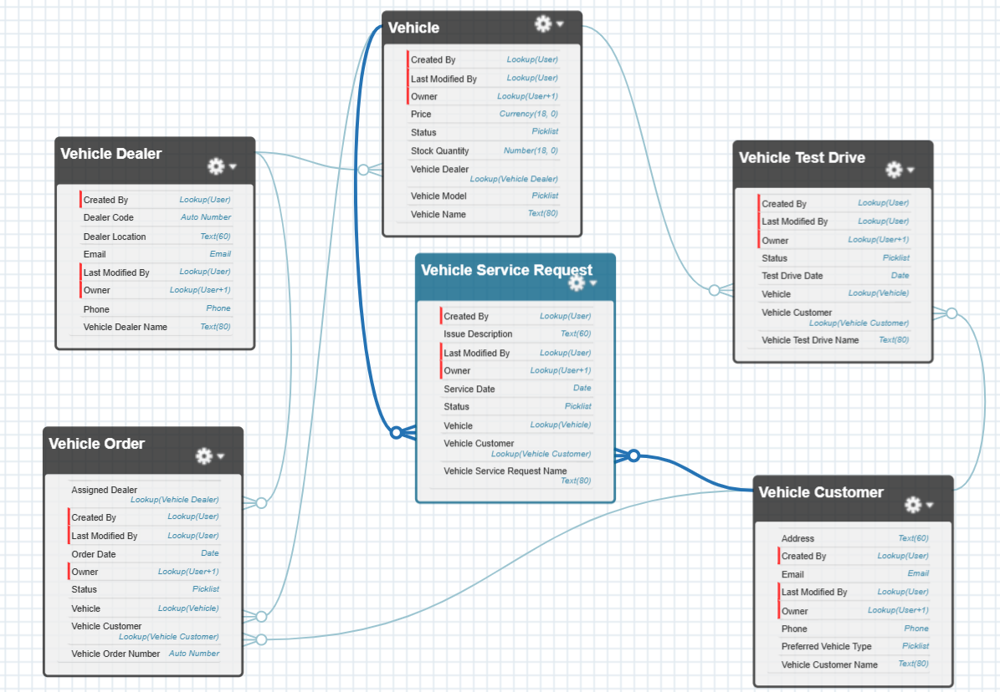

# 🚗 WhatNext Vision Motors – Salesforce CRM App

## 📌 Overview

**WhatNext Vision Motors** is a cloud-based CRM application built on the Salesforce platform to manage vehicle dealership operations. It enables smooth management of vehicles, test drives, service requests, dealers, and customer orders using both declarative and programmatic Salesforce tools.

This project is designed to simulate a real-world automotive CRM, showcasing data modeling, process automation, Apex development, and UI customization within Salesforce.

---

## 🚀 Features

- 🔧 **Vehicle Management** – Add, update, and track vehicle inventory
- 👥 **Customer Management** – Store and manage customer preferences and contact info
- 🛒 **Vehicle Orders** – Create and assign vehicle orders to customers
- 🧾 **Service Requests** – Submit and manage service requests for vehicles
- 🚗 **Test Drives** – Schedule and manage vehicle test drives
- 🛠️ **Automation** – Triggers, batch jobs, Flows and scheduled tasks

---

## 🧩 Data Model (Custom Objects)

| Object Name             | Description                                     |
|------------------------|-------------------------------------------------|
| `Vehicle__c`           | Stores vehicle info like name, model, price     |
| `Vehicle_Customer__c`  | Customer contact info and preferences           |
| `Vehicle_Dealer__c`    | Dealer details like code, location, phone       |
| `Vehicle_Order__c`     | Contains order data: customer, dealer, vehicle  |
| `Vehicle_Service_Request__c` | Manages vehicle service requests        |
| `Vehicle_Test_Drive__c`| Test drive scheduling and tracking              |

---

## 🛠️ Tools & Technologies

- Salesforce Platform (Developer Edition)
- Apex (Triggers, Batch, Schedulable)
- Process Builder & Validation Rules
- Schema Builder
- Data Import Wizard & Data Loader
- Lightning App Builder

---

## ⚙️ Key Automation Implemented

| Automation Type        | Description                                                           |
|------------------------|-----------------------------------------------------------------------|
| Apex Trigger           | Logic for updating related fields on insert/update                    |
| Batch Apex             | Bulk processing of order data                                         |
| Scheduled Job          | Scheduled execution of batch class daily                              |
| Validation Rules       | Enforce data quality and required fields                              |
| Field History Tracking | For critical fields like status and dates                             |
| Record Triggered Flow  | for test drive email remainder and assigne nearest dealer to customer |

---

## 🖼️ Schema Diagram

> Created using Salesforce **Schema Builder**  
> 

---

## 👤 Author

**[Siddharth Shukla]**  
Aspiring Salesforce Developer | Java Backend Enthusiast  
📧 Email: shuklasiddharth418@gmail.com 
🔗 GitHub: [Github](https://github.com/Siddharth3271)  
🔗 LinkedIn: [Linkedln](https://www.linkedin.com/in/siddharth-shukla-61ab0124b/)

---

## 📄 License

This project is created as part of a Salesforce internship/demo and is intended for learning and presentation purposes only.

Link for the Project demo video: https://drive.google.com/file/d/18l6b5eLK8MMPuYKRic6uujOsNs2MzCT4/view?usp=sharing
